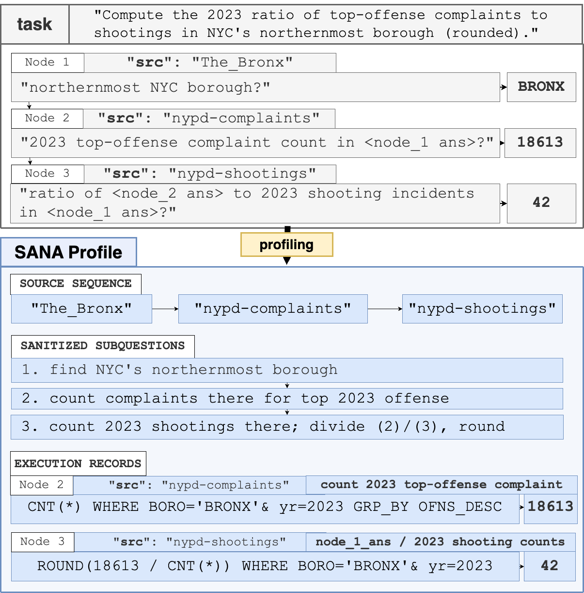
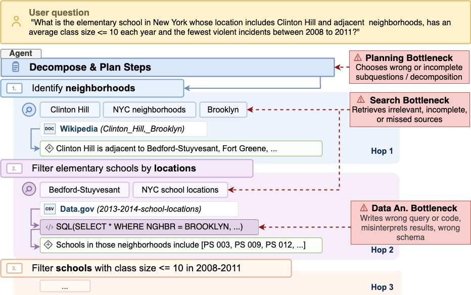
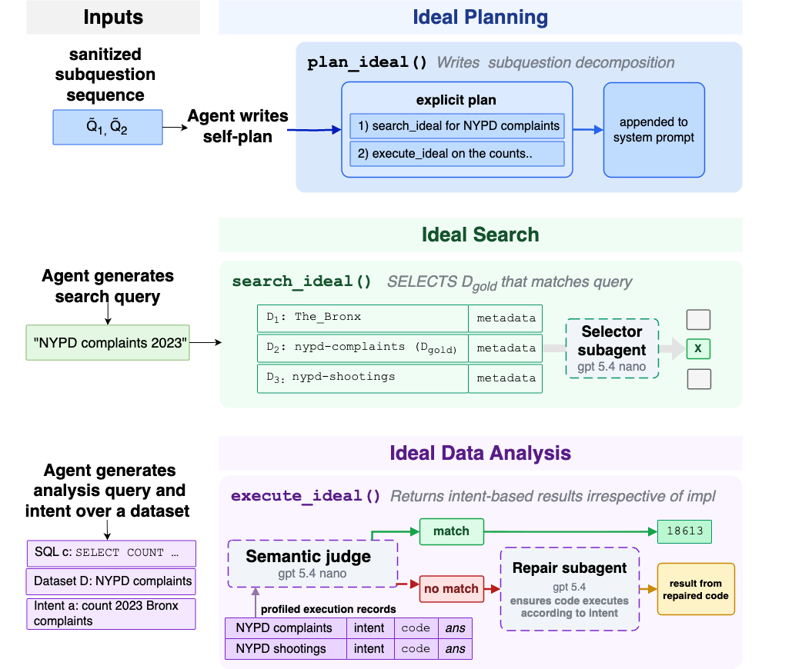

#  SANA

SANA is a diagnostic ablation framework for exploratory QA over data lakes. It
turns benchmark tasks into runtime profiles containing gold source sequences,
sanitized subquestions, and execution records, then uses those profiles to
ablate search, planning, and data-analysis tools under a fixed agent runtime.

## Visual Overview



SANA profiles mirror a task's reasoning structure into source sequences,
sanitized subquestions, and execution records. Those profiles support
controlled ablations over the parts of an exploratory QA agent that usually
fail independently: planning, search, and data analysis.



The framework isolates failure modes such as planning bottlenecks, missed or
irrelevant search results, and incorrect data-analysis execution.



Ideal runtime operators expose controlled planning, search, and data-analysis
interfaces for diagnostic runs.

## Repository Layout

- `sana_evaluation/`: runtime package for runners, preflight checks, agent
  configuration, tools, instrumentation, and model adapters.
- `sana_analysis/`: canonical import package for analysis and paper-result
  generation scripts.
- `assets/`: repository images and paper/reference media used by documentation.
- `benchmarks/{benchmark}/{task-set}/tasks/`: benchmark task JSON files.
- `benchmarks/{benchmark}/{task-set}/runtime-profiles/`: SANA runtime profiles
  used by ideal planning, search, and execution.
- `benchmarks/{benchmark}/{task-set}/artifacts/`: benchmark-local JSONL
  dependencies such as descriptions, snippets, schemas, and file profiles.
- `dataindexing/`: offline artifact generation and hybrid-search index
  construction.
- `results*/` and `sana-results*/`: evaluation outputs and semantic audit
  mirrors.
- `analysis_results*/`, `agent_analysis/`, and `paper_figures/`: analysis
  outputs and paper-ready derived artifacts.
- `other-benchmarks/`: raw and converted external benchmark imports.
- `legacy/`: archived historical outputs retained for reference.

Maintained examples:

| Benchmark | Task set | Tasks | Runtime profiles | Artifacts |
| --- | --- | --- | --- | --- |
| LakeQA | `tasks-mini` | `benchmarks/lakeqa/tasks-mini/tasks/` | `benchmarks/lakeqa/tasks-mini/runtime-profiles/` | `benchmarks/lakeqa/tasks-mini/artifacts/` |
| Kramabench | `tasks-mini` | `benchmarks/kramabench/tasks-mini/tasks/` | `benchmarks/kramabench/tasks-mini/runtime-profiles/` | `benchmarks/kramabench/tasks-mini/artifacts/` |

## Inspect Maintained Artifacts

```bash
python -m sana_evaluation.artifacts --benchmark lakeqa --check
python -m sana_evaluation.artifacts --benchmark kramabench --check
```

The report prints required roots, optional/generated roots, and copy-paste run
and analysis commands.

## Run Evaluations

Use `smoke` for the default two-task smoke directory, or `full` for the
maintained task set. Local runs should use the module form:

```bash
python -m sana_evaluation.setup_run smoke|full [options]
```

Common Kramabench full run:

```bash
python -m sana_evaluation.setup_run full \
  --benchmark kramabench \
  --search ideal \
  --plans standard \
  --compute ideal \
  --k 5 \
  --parallel 4 \
  --model openai/gpt-5-mini \
  --db lance_kramabench_infused \
  --timeout 600 \
  --submit-grace-seconds 30
```

`--results ideal`, `--verbose`, and `--continue` for `full` are defaults, so
they are omitted above. Prompt-cache flags are optional and intentionally
omitted from the standard example.

Usable `setup_run` options:

| Option | Values | Default | Definition |
| --- | --- | --- | --- |
| `smoke` / `full` | subcommand | required | `smoke` runs the benchmark's default smoke task directory with two tasks; `full` runs the maintained task set. |
| `--benchmark` | `lakeqa`, `kramabench` | `lakeqa` | Selects task roots, output roots, and benchmark-specific tool behavior. |
| `--search` | `naive`, `preloaded`, `standard`, `ideal` | `ideal` | Chooses the search-tool implementation exposed to the agent. |
| `--results` | `naive`, `ideal` | `ideal` | Chooses whether search returns live retrieved results or profile-backed ideal results. Usually omit this. |
| `--plans`, `--profile` | `naive`, `standard`, `ideal` | `ideal` | Chooses the planning/profile axis. `--plans` is the preferred alias; `--profile` is kept for compatibility. |
| `--compute` | `standard`, `ideal` | `ideal` | Chooses the data-analysis tools. `ideal` uses profile-backed ideal execution behavior. |
| `--k` | positive integer | run-mode default | Hard-coded search result limit passed to the runtime. |
| `--parallel` | positive integer | run-mode default | Number of parallel worker processes. |
| `--model` | model name | `bedrock/claude-sonnet-4.5` | Model adapter name, for example `openai/gpt-5-mini`. |
| `--db` | path | required | LanceDB root used by search tools, for example `lance_data` or `lance_kramabench_infused`. |
| `--timeout` | seconds | run-mode default | Per-task soft timeout. |
| `--submit-grace-seconds` | seconds | run-mode default | Extra time reserved for `submit_answer` after the soft timeout. |
| `--task-dir` | path | benchmark smoke default | Smoke-only override for the task directory to sample. |
| `--continue` | flag | on for `full` | Resume a full run by skipping tasks already present in the variant CSV. Kept for explicitness. |
| `--no-continue` | flag | off | Full-only override that reruns every task instead of resuming. |
| `--verbose` | flag | on | Emits verbose runtime logs. Kept for explicitness. |
| `--skills` | `on`, `off` | omitted/off | Enables or disables the Strands AgentSkills planning/discovery plugin. |
| `--reasoning-effort` | `none`, `minimal`, `low`, `medium`, `high`, `xhigh` | unset | Passes reasoning-effort metadata to supported model adapters. |
| `--search-free` | flag | off | Makes active search tools free against the global max-tool-calls limit. |
| `--search-lessguide` | flag | off | Hides `search_ideal` plan-exhausted guidance fields from tool payloads. |

## Analyze Existing Results

LakeQA:

```bash
python -m sana_analysis.run_mode_analysis_semantic \
  --results-dir results_semantic/modes \
  --base-results-dir results/modes \
  --traces-dir results/traces/modes \
  --tasks-dir benchmarks/lakeqa/tasks-mini/tasks \
  --output-dir analysis_results_mode_semantic
```

Kramabench:

```bash
python -m sana_analysis.run_mode_analysis_semantic \
  --results-dir results-kramabench_semantic/modes \
  --base-results-dir results-kramabench/modes \
  --traces-dir results-kramabench/traces/modes \
  --tasks-dir benchmarks/kramabench/tasks-mini/tasks \
  --output-dir analysis_results_mode_kramabench_semantic
```

Each top-level project root has a local `README.md` with ownership and layout
notes.
