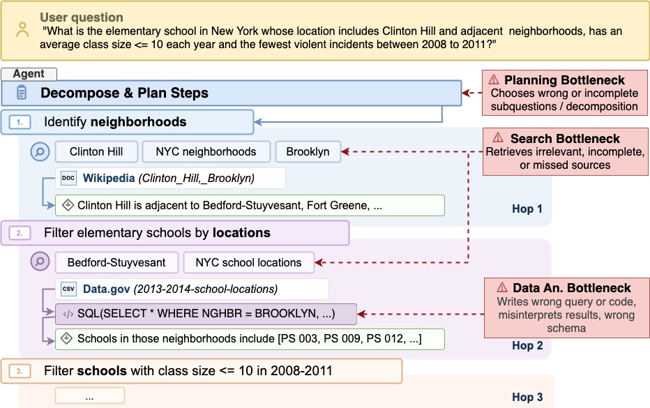
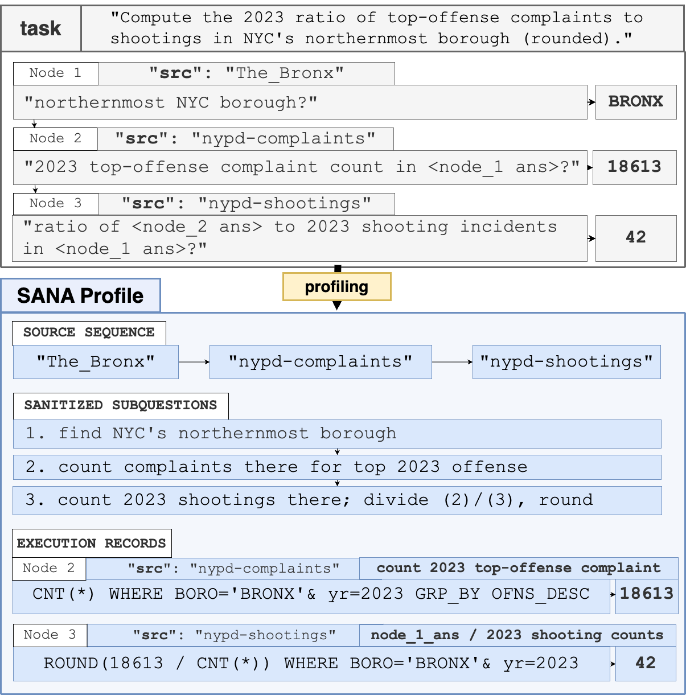
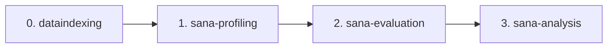
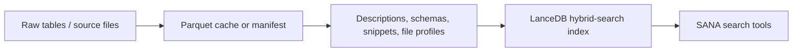
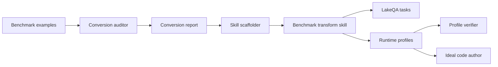
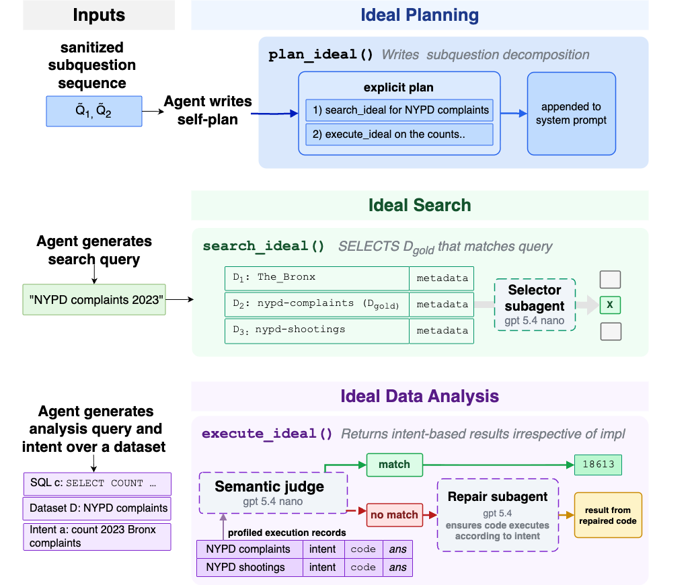
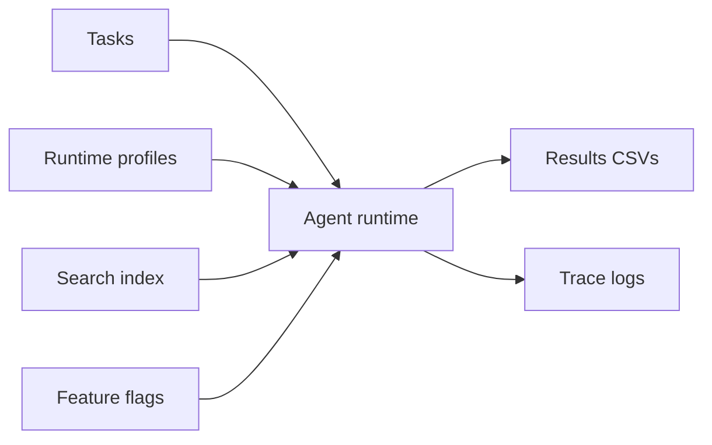
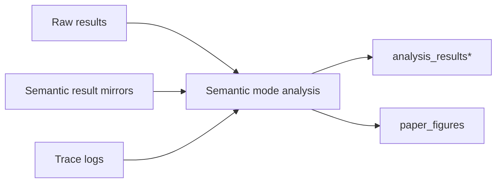

# SANA


SANA is a diagnostic ablation framework for exploratory QA over data lakes. It
turns benchmark tasks into runtime profiles containing gold source sequences,
sanitized subquestions, and execution records, then uses those profiles to
ablate search, profile guidance, and data-analysis tools under a fixed agent
runtime.

## How SANA Works

When an LLM agent fails at exploratory QA over a data lake, SANA asks which
part of the runtime is responsible. The agent normally has to decompose the
question, find the right sources, and compute the answer from those sources.
SANA replaces one stage at a time with an oracle built from the task's ground
truth. The accuracy gain from each replacement pinpoints the bottleneck.

The three stages are:

- Question decomposition: break the user question into ordered subquestions.
- Search: retrieve only the datasets or sources each subquestion needs.
- Data analysis: execute SQL or Python that matches the intended computation.



SANA profiles are the mechanism that makes those oracle swaps reproducible.
Each profile mirrors a task into source order, answer-safe subquestions, and
execution records. In a diagnostic run, the runtime can expose those profile
fields directly, hide them, or use them only inside ideal tools.





Each phase can be used independently. If you already have your own data lake,
retrieval service, or benchmark artifacts, you can replace that phase and keep
the SANA artifact contracts.

## 0. dataindexing

`dataindexing/` owns offline artifact generation and hybrid-search index
construction. This phase is only required when you want to recreate the search
indexes and benchmark-local artifacts used by our runs. External users can
instead provide their own search backend as long as the evaluation tools can
query it.



Generic LakeQA/Data.gov artifact build:

```bash
python -m dataindexing.cli.to_parquet \
  --output datalake_with_schema.parquet

python -m dataindexing.cli.parquet_to_description \
  datalake_with_schema.parquet \
  --output benchmarks/lakeqa/tasks-mini/artifacts/descriptions.jsonl \
  --parquet-output table_descriptions.parquet

python -m dataindexing.cli.build_hybrid_search \
  --embed-preset qwen3_0_6b \
  --build-mode infused \
  --parquet datalake_with_schema.parquet \
  --descriptions benchmarks/lakeqa/tasks-mini/artifacts/descriptions.jsonl \
  --schemas benchmarks/lakeqa/tasks-mini/artifacts/table_schemas_full.jsonl \
  --output lance_data
```

Kramabench artifact build:

```bash
python -m dataindexing.cli.extract_kramabench_tables \
  --eval-root . \
  --output-parquet kramabench_tables.parquet \
  --output-schemas kramabench_table_schemas.jsonl \
  --output-manifest kramabench_table_manifest.jsonl \
  --output-report kramabench_extract_report.json \
  --tables-dir kramabench_tables

python -m dataindexing.cli.parquet_to_description \
  kramabench_table_manifest.jsonl \
  --input-format auto \
  --output kramabench_descriptions.jsonl \
  --parquet-output kramabench_descriptions.parquet

python -m dataindexing.cli.build_hybrid_search \
  --embed-preset qwen3_0_6b \
  --build-mode infused \
  --parquet kramabench_tables.parquet \
  --descriptions kramabench_descriptions.jsonl \
  --schemas kramabench_table_schemas.jsonl \
  --output lance_kramabench_infused
```

## 1. sana-profiling

`sana-profiling/` contains the framework-facing workflow for turning an
external QA benchmark into LakeQA-style task artifacts and matching SANA runtime
profiles. The current conversion path is intentionally report-first: sample
benchmark examples, infer a conversion method, scaffold a transform skill from
that report, then run the generated skill on benchmark instances.



HotpotQA generated-conversion example:

```bash
python sana-profiling/skills/benchmark-lakeqa-conversion-auditor/scripts/sample_benchmark_artifacts.py \
  other-benchmarks/tasks-hotpotqa-mini \
  --limit 10 \
  > sana-profiling/runs/hotpotqa-generated-conversion/sampled-artifacts.json

python sana-profiling/skills/benchmark-lakeqa-skill-scaffolder/scripts/scaffold_benchmark_skill.py \
  sana-profiling/runs/hotpotqa-generated-conversion/hotpotqa-lakeqa-conversion-report.md \
  --benchmark hotpotqa \
  --output-root sana-profiling/runs/hotpotqa-generated-conversion/generated-skills \
  --force
```

That run generated a `hotpotqa-lakeqa-transform` skill and applied it to five
sampled imports. The dry-run output is under:

- `sana-profiling/runs/hotpotqa-generated-conversion/generated-skills/`
- `sana-profiling/runs/hotpotqa-generated-conversion/converted/benchmarks/hotpotqa/tasks-mini/tasks/`
- `sana-profiling/runs/hotpotqa-generated-conversion/converted/benchmarks/hotpotqa/tasks-mini/runtime-profiles/`
- `sana-profiling/runs/hotpotqa-generated-conversion/validation.json`

Maintained benchmark examples live under:

| Benchmark | Tasks | Runtime profiles | Artifacts |
| --- | --- | --- | --- |
| LakeQA | `benchmarks/lakeqa/tasks-mini/tasks/` | `benchmarks/lakeqa/tasks-mini/runtime-profiles/` | `benchmarks/lakeqa/tasks-mini/artifacts/` |
| Kramabench | `benchmarks/kramabench/tasks-mini/tasks/` | `benchmarks/kramabench/tasks-mini/runtime-profiles/` | `benchmarks/kramabench/tasks-mini/artifacts/` |

## 2. sana-evaluation

`sana_evaluation/` runs task sets with controlled runtime axes for search,
retrieved results, profile guidance, optional skills, and computation. Use
`smoke` while checking installation and `full` for the maintained task set.





Inspect maintained artifacts:

```bash
python -m sana_evaluation.artifacts --benchmark lakeqa --check
python -m sana_evaluation.artifacts --benchmark kramabench --check
```

LakeQA smoke run:

```bash
python -m sana_evaluation.setup_run smoke \
  --benchmark lakeqa \
  --search ideal \
  --results ideal \
  --profile ideal \
  --compute ideal \
  --skills off \
  --k 5 \
  --model openai/gpt-5.4-nano \
  --db lance_data
```

Kramabench smoke run:

```bash
python -m sana_evaluation.setup_run smoke \
  --benchmark kramabench \
  --search ideal \
  --results ideal \
  --profile ideal \
  --compute ideal \
  --skills off \
  --k 5 \
  --model openai/gpt-5.4-nano \
  --db lance_kramabench_infused
```

Full maintained-task run:

```bash
python -m sana_evaluation.setup_run full \
  --benchmark kramabench \
  --search ideal \
  --results ideal \
  --profile standard \
  --compute ideal \
  --skills off \
  --k 5 \
  --parallel 4 \
  --model openai/gpt-5-mini \
  --db lance_kramabench_infused \
  --timeout 600 \
  --submit-grace-seconds 30 \
  --continue
```

Common feature flags:

| Option | Values | Default | Use |
| --- | --- | --- | --- |
| `smoke` / `full` | subcommand | required | `smoke` runs a lightweight sample; `full` runs the maintained task set. |
| `--benchmark` | `lakeqa`, `kramabench` | `lakeqa` | Selects task roots, output roots, and benchmark-specific tool behavior. |
| `--search` | `naive`, `preloaded`, `standard`, `ideal` | `ideal` | Chooses the search-tool implementation exposed to the agent. |
| `--results` | `naive`, `ideal` | `ideal` | Chooses live retrieved results or profile-backed ideal result payloads. |
| `--profile` | `naive`, `standard`, `ideal` | `ideal` | Chooses how much runtime-profile guidance is exposed. |
| `--compute` | `standard`, `ideal` | `ideal` | Chooses regular data-analysis tools or profile-backed ideal computation. |
| `--skills` | `on`, `off` | omitted/off | Enables or disables the AgentSkills plugin. |
| `--k` | positive integer | mode default | Search result limit passed to runtime tools. |
| `--parallel` | positive integer | mode default | Number of parallel worker processes. |
| `--model` | model name | `bedrock/claude-sonnet-4.5` | Model adapter name, for example `openai/gpt-5-mini`. |
| `--reasoning-effort` | `none`, `minimal`, `low`, `medium`, `high`, `xhigh` | unset | Reasoning-effort metadata for supported model adapters. |
| `--ideal-subagent-model` | model name | `--model` | Default hidden helper model for ideal-mode tools. |
| `--search-ideal-subagent-model` | model name | unset | Helper model for `search_ideal` selection. |
| `--semantic-ideal-subagent-model` | model name | unset | Helper model for semantic checks in ideal computation tools. |
| `--repair-ideal-subagent-model` | model name | unset | Helper model for ideal computation repair attempts. |
| `--openai-prompt-cache-key` | string | unset | Prompt-cache key for OpenAI-backed adapters. |
| `--openai-prompt-cache-retention` | string | unset | Prompt-cache retention policy for OpenAI-backed adapters. |
| `--db` | path | required | LanceDB root, for example `lance_data` or `lance_kramabench_infused`. |
| `--condition` | `baseline` | `baseline` | Output condition label. |
| `--timeout` | seconds | mode default | Per-task soft timeout. |
| `--submit-grace-seconds` | seconds | mode default | Extra time reserved for final answer submission after timeout. |
| `--task-dir` | path | smoke default | Smoke-only task directory override. |
| `--continue` | flag | on for `full` | Full-only resume mode that skips existing rows in the variant CSV. |
| `--no-continue` | flag | off | Full-only rerun mode. |
| `--verbose` | flag | on | Emits verbose per-task runtime logs. |
| `--search-free` | flag | off | Makes active search calls free against the global tool-call limit. |
| `--search-lessguide` | flag | off | Hides exhausted-search guidance fields from ideal search payloads. |

## 3. sana-analysis

`sana_analysis/` consumes result CSVs, semantic mirrors, traces, and task files
to produce aggregate mode analyses and paper-ready artifacts.



LakeQA semantic mode analysis:

```bash
python -m sana_analysis.run_mode_analysis_semantic \
  --results-dir results_semantic/modes \
  --base-results-dir results/modes \
  --traces-dir results/traces/modes \
  --tasks-dir benchmarks/lakeqa/tasks-mini/tasks \
  --output-dir analysis_results_mode_semantic
```

Kramabench semantic mode analysis:

```bash
python -m sana_analysis.run_mode_analysis_semantic \
  --results-dir results-kramabench_semantic/modes \
  --base-results-dir results-kramabench/modes \
  --traces-dir results-kramabench/traces/modes \
  --tasks-dir benchmarks/kramabench/tasks-mini/tasks \
  --output-dir analysis_results_mode_kramabench_semantic
```

Package ownership:

- `dataindexing/`: offline artifact generation and hybrid-search index build.
- `sana-profiling/`: benchmark conversion workflow and runtime-profile authoring.
- `sana_evaluation/`: runners, tool wiring, instrumentation, and model adapters.
- `sana_analysis/`: result aggregation, semantic analysis, and report generation.
